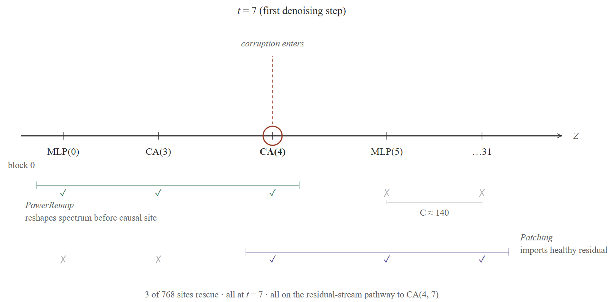

## Qualitative Figures

### WaLa

#### Sphere

In Figure R1 and R2, we show the phenomenon on basic geometries. Moving via small steps achieves the sudden Meltdown.

#### Google Scanned Objects

#### Other Basic Geometries

### Make-A-Shape

#### Sphere

#### Google Scanned Objects

#### Other Basic Geometries

---

## Quantitative Figures

**Figure R1.** Complementary spatial footprints of PowerRemap and activation patching along the residual stream at $t=7$. PowerRemap (green) rescues only at sites upstream of or at $CA(4,7)$, by compressing the current spectrum before corruption enters the stream. Patching (purple) rescues at and downstream of $CA(4,7)$, by importing activations from a healthy forward pass that already contain the uncorrupted cross-attention write. Of 768 tested sites, only 3 (0.4%) produce a valid rescue — all on the causal pathway to $CA(4,7)$.

**Figure R2.** Number of seeds $n$ (out of 100) converging to the sphere attractor ($C=1$) versus the speckle attractor ($C>1$) as a function of $\rho$. At intermediate $\rho$, both attractors coexist in the ensemble.

**Figure R3:** Relative rate of change $\Delta_{\mathrm{rel}}$ of the normalized centroid separation between sphere and speckle trajectories across consecutive denoising steps $t$. The peak (highlighted bar) identifies the bifurcation at $\tau^* \approx 5$, demarcating the mean-reverting and basin-settling regimes of the reverse process.

