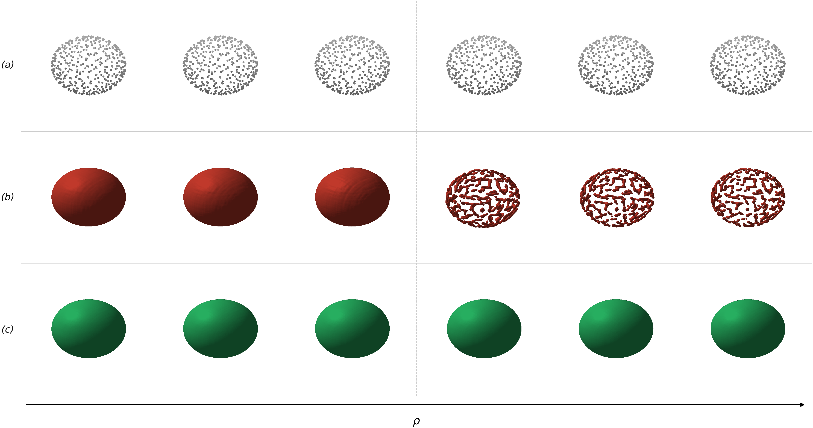
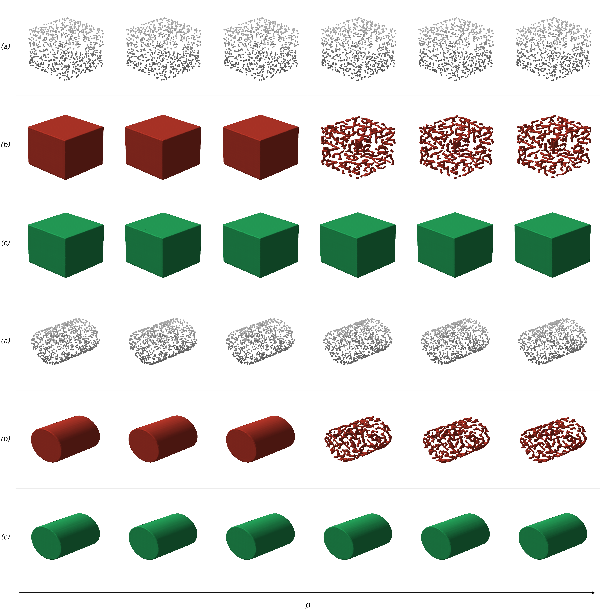
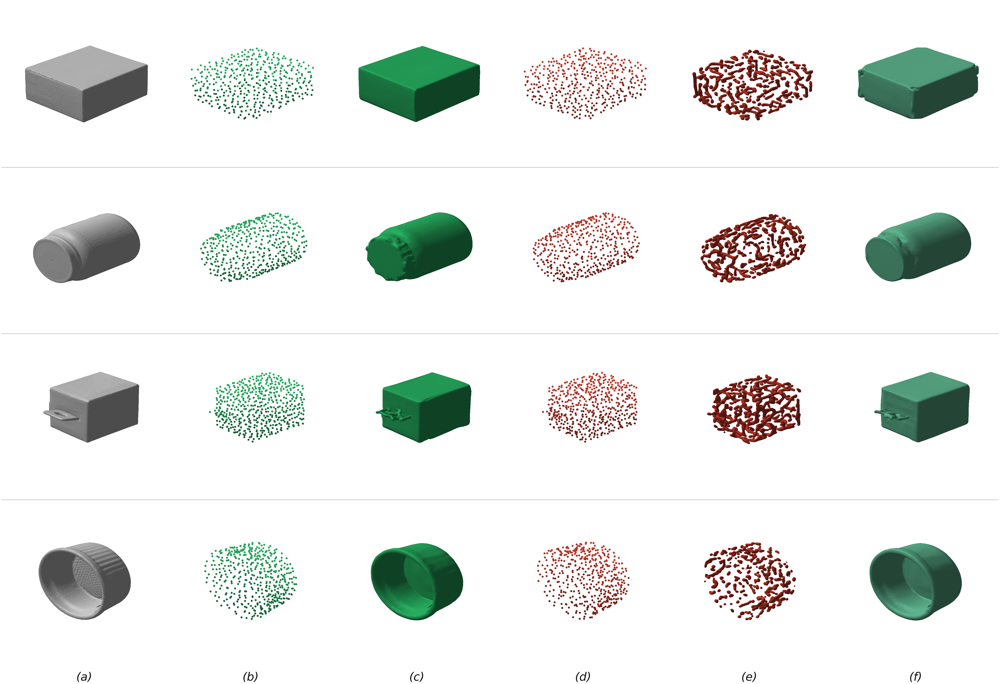
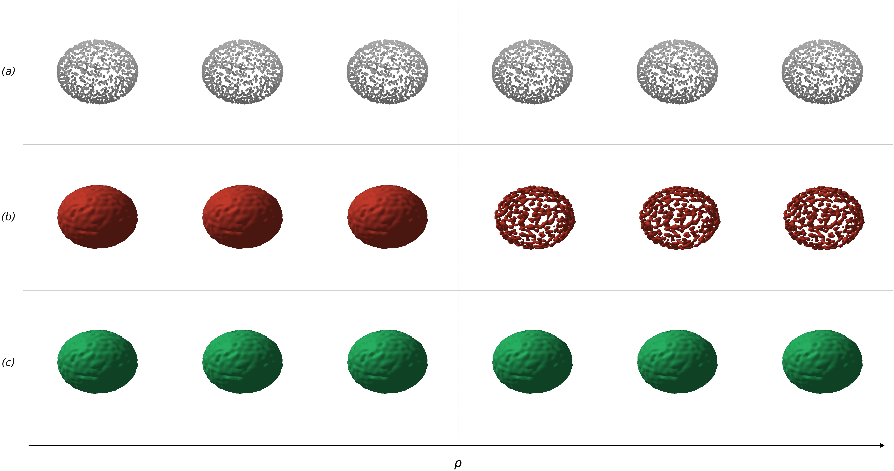
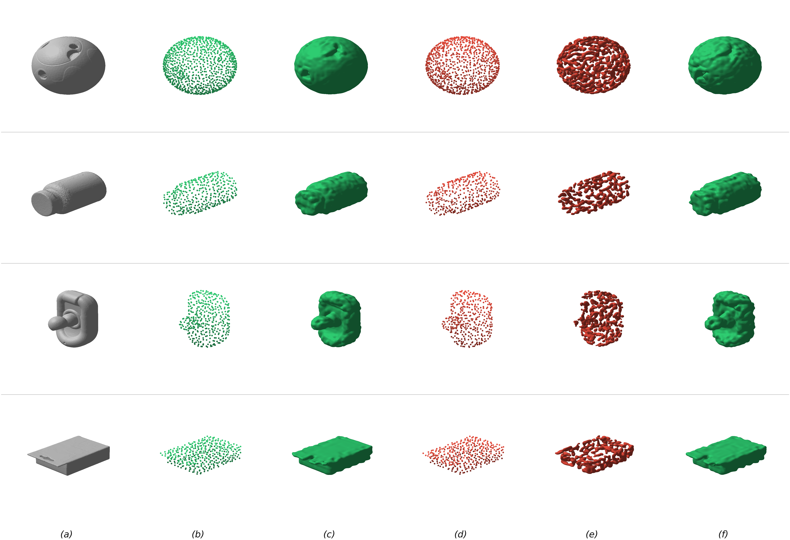
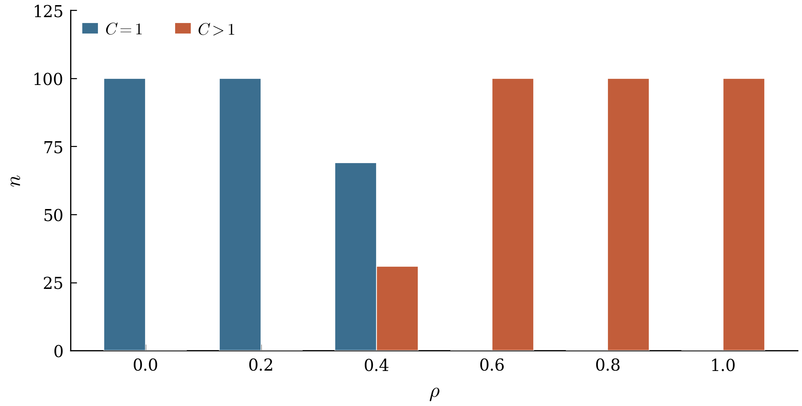
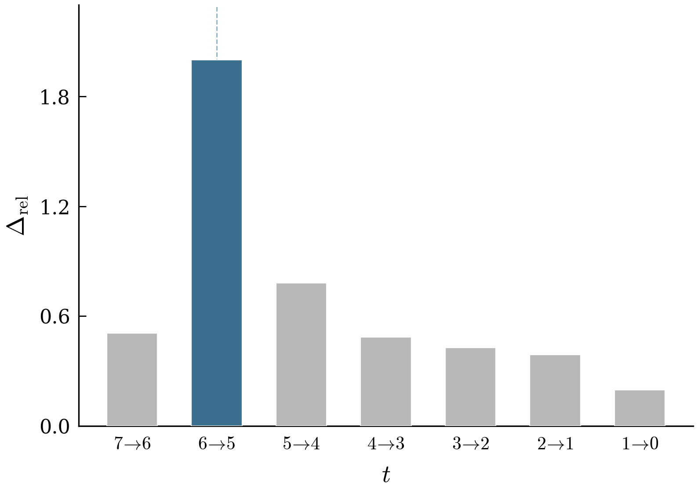

## Qualitative Figures

### WaLa

#### Basic Geometry

In Figure R1 and R2, we show the phenomenon on basic geometries. Moving via small steps achieves the sudden Meltdown.

#### Google Scanned Objects

### Make-A-Shape

---

## Quantitative Figures

**Figure R1.** Number of seeds $n$ (out of 100) converging to the sphere attractor ($C=1$) versus the speckle attractor ($C>1$) as a function of $\rho$. At intermediate $\rho$, both attractors coexist in the ensemble.

**Figure R2:** Relative rate of change $\Delta_{\mathrm{rel}}$ of the normalized centroid separation between sphere and speckle trajectories across consecutive denoising steps $t$. The peak (highlighted bar) identifies the bifurcation at $\tau^* \approx 5$, demarcating the mean-reverting and basin-settling regimes of the reverse process.

