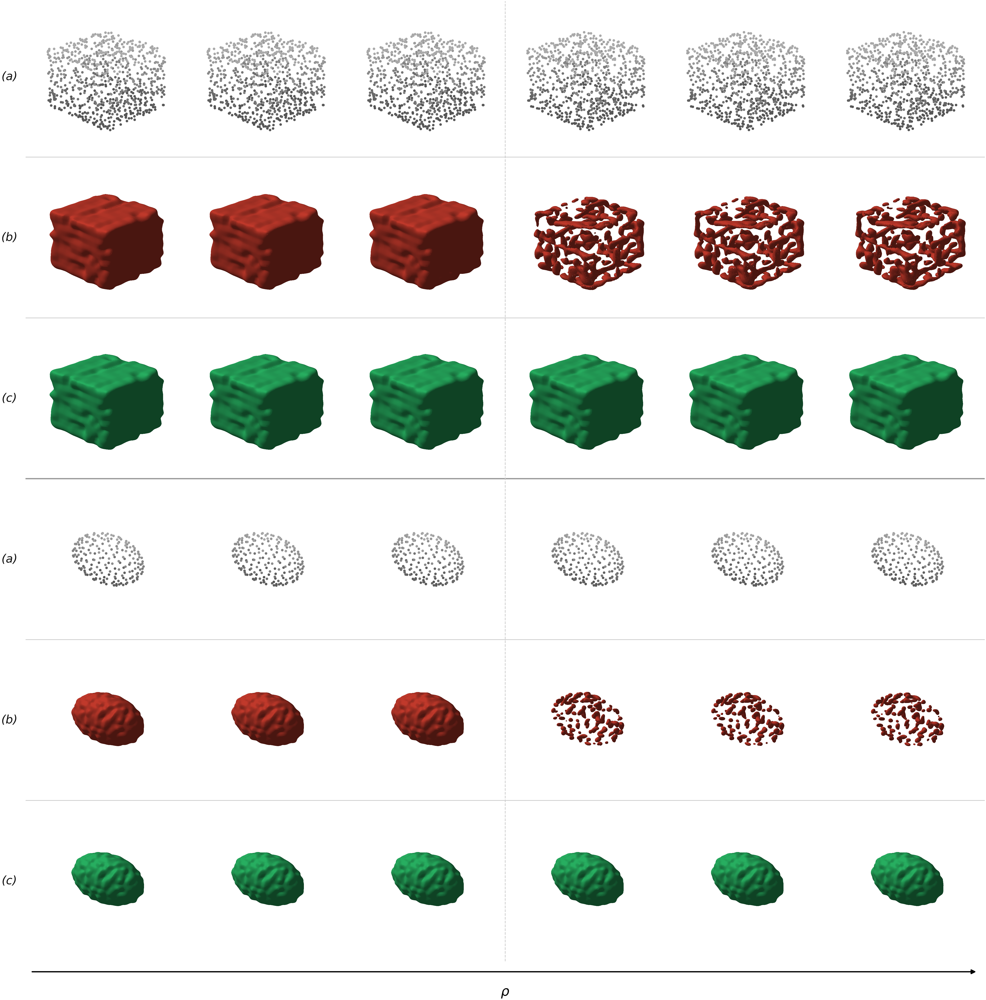

## Qualitative Figures

### WaLa

#### Sphere

In Figure R1 and R2, we show the phenomenon on basic geometries. Moving via small steps achieves the sudden Meltdown.

**Figure R1.** Meltdown on the unit sphere (WaLa, DDIM, $N=400$). (a) Input point clouds $P_\rho$; (b) baseline reconstruction $G(P_\rho)$; (c) PowerRemap reconstruction. Left: healthy ($C=1$); right: Meltdown ($C \gg 1$). Adjacent columns differ by 0.2° of maximum geodesic arc ($\approx 0.003$ on the unit sphere).

#### Google Scanned Objects

**Figure R2.** Meltdown on Google Scanned Objects (WaLa). Columns: (a) ground truth; (b) input point cloud $P_0$; (c) baseline output $G(P_0)$; (d) perturbed input $P_\epsilon$; (e) Meltdown output $G(P_\epsilon)$; (f) PowerRemap output.

#### Other Basic Geometries

**Figure R3.** Meltdown on cube (top block) and cylinder (bottom block), WaLa. Layout as Fig. R1. Each column step $\approx 0.003$ maximum Euclidean displacement on unit-scale shapes, comparable to the sphere's 0.2° arc.

### Make-A-Shape

#### Sphere

**Figure R4.** Meltdown on the unit sphere (Make-a-Shape, DDIM, $N=1200$). Layout as Fig. R1.

#### Google Scanned Objects

**Figure R5.** Meltdown on Google Scanned Objects (Make-a-Shape). Layout as Fig. R2.

#### Other Basic Geometries

**Figure R6.** Meltdown on cube (top) and cylinder (bottom), Make-a-Shape. Layout as Fig. R3.
---

## Quantitative Figures

**Figure R1.** PowerRemap (green) rescues only at sites upstream of or at $CA(4,7)$, by compressing the current spectrum before corruption enters the stream. Patching (purple) rescues at and downstream of $CA(4,7)$, by importing activations from a healthy forward pass that already contain the uncorrupted cross-attention write. Of 768 tested sites, only 3 (0.4%) produce a valid rescue with PowerRemap — all on the pathway to $CA(4,7)$.

**Figure R2.** Number of seeds $n$ (out of 100) converging to the sphere attractor ($C=1$) versus the speckle attractor ($C>1$) as a function of $\rho$. At intermediate $\rho$, both attractors coexist in the ensemble.

**Figure R3:** Relative rate of change $\Delta_{\mathrm{rel}}$ of the normalized centroid separation between sphere and speckle trajectories across consecutive denoising steps $t$. The peak (highlighted bar) identifies the bifurcation at $\tau^* \approx 5$, demarcating the mean-reverting and basin-settling regimes of the reverse process.

